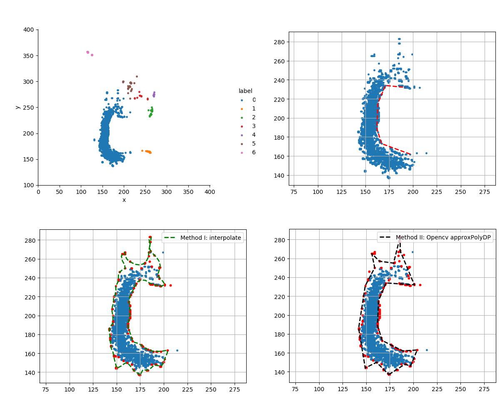

Clustering Projects
=======
⭐[proj1](proj1) clusters video fisher vectors from [tk42635/Weakly-Supervised-TemporalSegmentationn](../Weakly-Supervised-TemporalSegmentationn) through the spectral clustering.

⭐[proj2](proj2) clusters 2D sparse point data and depicts a concave boundary of the dominating cluster.

